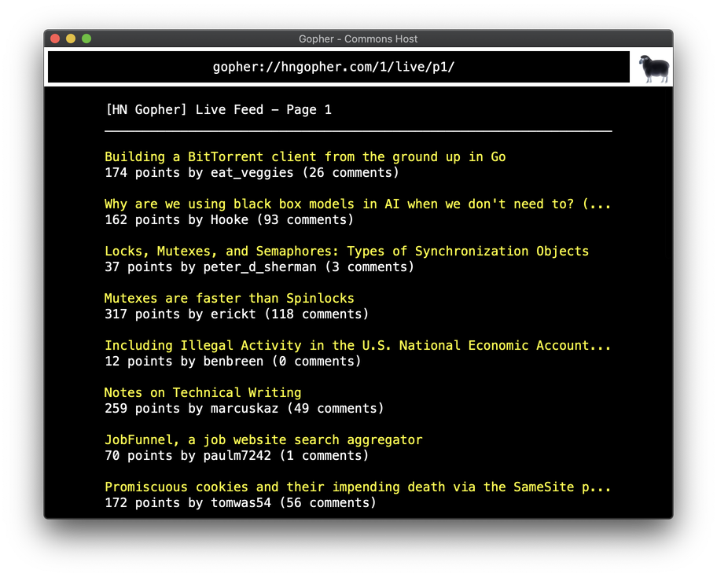

# 🌎 gogo 

WebKit-based Gopher desktop client. 

Inspired by [OpenNapkin][OpenNapkin] and https://gopher.commons.host,
gogo is a desktop Gopher client powered by [phroxy][phroxy] and your
operating system's native [WebView][web-view].

## status

⚠️ This project is mostly dead - I recommend just using your a web browser
directly with [Phroxy], using a CLI client like [phetch], or downloading a 
more full featured desktop client like [Kristall].

## installation

Standalone binaries are coming soon. For now you have to build from
source. 

On Linux, you must first install webkit2gtk:

    sudo apt install webkit2gtk-4.0

Then, assuming you have Rust/Cargo and Git installed:

    git clone https://github.com/xvxx/gogo
    cd gogo
    cargo install --path .
    gogo <gopher-url>

## screenies

|||
|:-:|:-:|
| RPoD | hngopher.com |

## todo

- [ ] keyboard shortcuts
- [ ] new window
- [ ] ...tabs?
- [ ] bookmarks
- [ ] history
- [ ] share history and bookmarks format with phetch

[phroxy]: https://github.com/xvxx/phroxy
[phetch]: https://github.com/xvxx/phetch
[web-view]: https://github.com/boscop/web-view
[OpenNapkin]: https://github.com/Lartu/OpenNapkin
[Kristall]: https://github.com/MasterQ32/kristall
